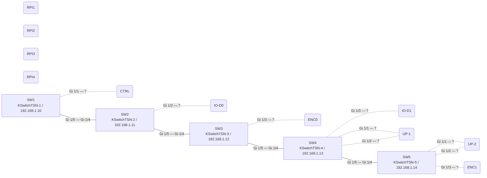

# Discovered topology — FlexTest TSN testbed

Generated 2026-09-18T15:27:05.866250+00:00 by `tsn_discovery` 1.0.0 (run `20260918-152705`).

**This file is generated. Do not edit it by hand** — re-run `scripts/run_discovery.sh` instead.

Method: switch-to-switch links come from IEEE 802.1AB LLDP — `remote-systems-data` over NETCONF, or `show lldp neighbors` where a switch fell back to the CLI. Endpoint attachments come from the IEEE 802.1Q filtering database, and only on ports that LLDP has not already claimed as an inter-switch link. Names are resolved against `/home/claude/SYSTEM.md`, which is used as a cross-check oracle and never as a source of links.

Transports this run: **cli** on SW1, SW2, SW3, SW4, SW5. See `capabilities.md` §1 for why.

## 1. Summary

- Nodes: **16** (5 switches, 11 endpoints, 0 unidentified)
- Links: **13** (4 from LLDP, of which 4 confirmed from both ends; 9 endpoint attachments from the FDB)
- Cross-check against the inventory: **agrees**

## 2. Diagram

Solid edges are LLDP-discovered links; dotted edges are endpoint attachments inferred from the filtering database.

## 3. Links

| A | A port | B | B port | Method | Both ends | Resolution |
|---|---|---|---|---|---|---|
| SW1 | `Gi 1/1` | CTRL | `-` | fdb | no | SYSTEM.md MAC match in 802.1Q filtering database |
| SW1 | `Gi 1/5` | SW2 | `Gi 1/4` | lldp | yes | bridge-address match |
| SW2 | `Gi 1/2` | IO-D0 | `-` | fdb | no | SYSTEM.md MAC match in 802.1Q filtering database |
| SW2 | `Gi 1/5` | SW3 | `Gi 1/4` | lldp | yes | bridge-address match |
| SW3 | `Gi 1/3` | ENC0 | `-` | fdb | no | SYSTEM.md MAC match in 802.1Q filtering database |
| SW3 | `Gi 1/5` | SW4 | `Gi 1/4` | lldp | yes | bridge-address match |
| SW4 | `Gi 1/1` | UP-1 | `-` | fdb | no | SYSTEM.md MAC match in 802.1Q filtering database |
| SW4 | `Gi 1/2` | UP-1 | `-` | fdb | no | SYSTEM.md MAC match in 802.1Q filtering database |
| SW4 | `Gi 1/3` | IO-D1 | `-` | fdb | no | SYSTEM.md MAC match in 802.1Q filtering database |
| SW4 | `Gi 1/5` | SW5 | `Gi 1/4` | lldp | yes | bridge-address match |
| SW5 | `Gi 1/1` | UP-2 | `-` | fdb | no | SYSTEM.md MAC match in 802.1Q filtering database |
| SW5 | `Gi 1/2` | UP-2 | `-` | fdb | no | SYSTEM.md MAC match in 802.1Q filtering database |
| SW5 | `Gi 1/3` | ENC1 | `-` | fdb | no | SYSTEM.md MAC match in 802.1Q filtering database |

## 4. Nodes

| Node | Role | Hostname | Management IP | Discovered | In SYSTEM.md | MACs |
|---|---|---|---|---|---|---|
| CTRL | endpoint | - | 192.168.1.120 | yes | yes | `00:bb:cc:dd:ee:12` |
| ENC0 | endpoint | - | 192.168.1.140 | yes | yes | `00:bb:cc:dd:ee:14` |
| ENC1 | endpoint | - | 192.168.1.160 | yes | yes | `00:bb:cc:dd:ee:16` |
| IO-D0 | endpoint | - | 192.168.1.130 | yes | yes | `00:bb:cc:dd:ee:13` |
| IO-D1 | endpoint | - | 192.168.1.150 | yes | yes | `00:bb:cc:dd:ee:15` |
| RPI1 | endpoint | - | 192.168.1.51 | no | yes | `88:a2:9e:4b:97:1b` |
| RPI2 | endpoint | - | 192.168.1.52 | no | yes | `88:a2:9e:a6:d1:5f` |
| RPI3 | endpoint | - | 192.168.1.53 | no | yes | `88:a2:9e:a6:cb:86` |
| RPI4 | endpoint | - | 192.168.1.54 | no | yes | `88:a2:9e:a6:bb:a4` |
| UP-1 | endpoint | - | 192.168.1.61 | yes | yes | `00:07:32:c1:43:30`, `00:07:32:c1:43:31` |
| UP-2 | endpoint | - | 192.168.1.71 | yes | yes | `00:07:32:c1:29:69`, `00:07:32:c1:29:6a` |
| SW1 | switch | KSwitchTSN-1 | 192.168.1.10 | yes | yes | `00:80:82:b9:65:33` |
| SW2 | switch | KSwitchTSN-2 | 192.168.1.11 | yes | yes | `00:80:82:bd:25:7c` |
| SW3 | switch | KSwitchTSN-3 | 192.168.1.12 | yes | yes | `00:80:82:bd:25:a2` |
| SW4 | switch | KSwitchTSN-4 | 192.168.1.13 | yes | yes | `00:80:82:bd:25:80` |
| SW5 | switch | KSwitchTSN-5 | 192.168.1.14 | yes | yes | `00:80:82:bd:25:72` |

## 5. Cross-check against the inventory

- Devices in the inventory: 16
- Devices seen by discovery: 12
- Endpoints in SYSTEM.md not observed: RPI1, RPI2, RPI3, RPI4
  (not necessarily a fault: an end station that neither runs LLDP nor has transmitted recently has no filtering-database entry and is invisible to both discovery methods. Generate traffic from it, or shorten the FDB aging time, and re-run.)
  There are 4 port(s) with a link and nothing identified on them — `SW2:Gi 1/6`, `SW3:Gi 1/6`, `SW4:Gi 1/6`, `SW5:Gi 1/6`. That is the same count as the unobserved endpoints above, so those devices are most likely cabled there and simply silent. Ping from one and re-run to confirm which is which.
- No discrepancies.

## 6. Notes from the run

- UP-1 (00:07:32:c1:43:31) learned on SW1:Gi 1/5, which is an inter-switch link -- not treated as an attachment
- IO-D0 (00:bb:cc:dd:ee:13) learned on SW1:Gi 1/5, which is an inter-switch link -- not treated as an attachment
- ENC0 (00:bb:cc:dd:ee:14) learned on SW1:Gi 1/5, which is an inter-switch link -- not treated as an attachment
- IO-D1 (00:bb:cc:dd:ee:15) learned on SW1:Gi 1/5, which is an inter-switch link -- not treated as an attachment
- ENC1 (00:bb:cc:dd:ee:16) learned on SW1:Gi 1/5, which is an inter-switch link -- not treated as an attachment
- UP-1 (00:07:32:c1:43:31) learned on SW2:Gi 1/5, which is an inter-switch link -- not treated as an attachment
- CTRL (00:bb:cc:dd:ee:12) learned on SW2:Gi 1/4, which is an inter-switch link -- not treated as an attachment
- ENC0 (00:bb:cc:dd:ee:14) learned on SW2:Gi 1/5, which is an inter-switch link -- not treated as an attachment
- IO-D1 (00:bb:cc:dd:ee:15) learned on SW2:Gi 1/5, which is an inter-switch link -- not treated as an attachment
- ENC1 (00:bb:cc:dd:ee:16) learned on SW2:Gi 1/5, which is an inter-switch link -- not treated as an attachment
- UP-1 (00:07:32:c1:43:31) learned on SW3:Gi 1/5, which is an inter-switch link -- not treated as an attachment
- CTRL (00:bb:cc:dd:ee:12) learned on SW3:Gi 1/4, which is an inter-switch link -- not treated as an attachment
- IO-D0 (00:bb:cc:dd:ee:13) learned on SW3:Gi 1/4, which is an inter-switch link -- not treated as an attachment
- IO-D1 (00:bb:cc:dd:ee:15) learned on SW3:Gi 1/5, which is an inter-switch link -- not treated as an attachment
- ENC1 (00:bb:cc:dd:ee:16) learned on SW3:Gi 1/5, which is an inter-switch link -- not treated as an attachment
- UP-2 (00:07:32:c1:29:69) learned on SW4:Gi 1/5, which is an inter-switch link -- not treated as an attachment
- CTRL (00:bb:cc:dd:ee:12) learned on SW4:Gi 1/4, which is an inter-switch link -- not treated as an attachment
- IO-D0 (00:bb:cc:dd:ee:13) learned on SW4:Gi 1/4, which is an inter-switch link -- not treated as an attachment
- ENC0 (00:bb:cc:dd:ee:14) learned on SW4:Gi 1/4, which is an inter-switch link -- not treated as an attachment
- ENC1 (00:bb:cc:dd:ee:16) learned on SW4:Gi 1/5, which is an inter-switch link -- not treated as an attachment
- UP-1 (00:07:32:c1:43:31) learned on SW5:Gi 1/4, which is an inter-switch link -- not treated as an attachment
- CTRL (00:bb:cc:dd:ee:12) learned on SW5:Gi 1/4, which is an inter-switch link -- not treated as an attachment
- IO-D0 (00:bb:cc:dd:ee:13) learned on SW5:Gi 1/4, which is an inter-switch link -- not treated as an attachment
- ENC0 (00:bb:cc:dd:ee:14) learned on SW5:Gi 1/4, which is an inter-switch link -- not treated as an attachment
- IO-D1 (00:bb:cc:dd:ee:15) learned on SW5:Gi 1/4, which is an inter-switch link -- not treated as an attachment
- 4 port(s) have a link but nothing identified on it: SW2:Gi 1/6, SW3:Gi 1/6, SW4:Gi 1/6, SW5:Gi 1/6. Something is cabled there and has not spoken.

